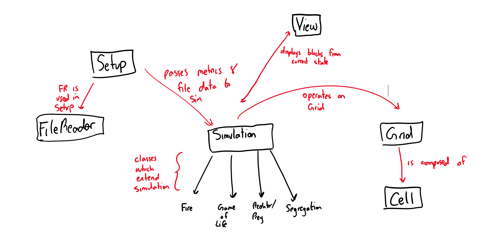
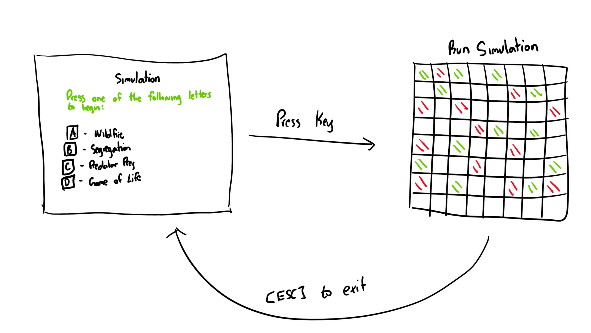

# Simulation Design Plan
### Team Number: 27
### Names: Lorne Zhang, Cary Shindell, Ameer Syedibrahim


## Introduction

Our team is attempting to solve the problem of designing components of a CA simulation such that any new simulation with its specific rules can be implemented with relative ease using the components of our simulation. 

The Simulation class will mostly have data and methods which are public to use because it is being updated constantly by the game engine and displayed by the View class. However, certain logic about how the simulation updates the cells in its grid can remain private.

The Cell and Grid classes have data which is mostly self-contained. These classes will communicate with the Simulation class which is responsible for running the interaction between cells. The Game Engine and Simulation class will most likely communicate with one another to initiate the simulation and pass components back and forth.


## Overview



Cell Class - This component serves as the building block for the simulation. Every simulation, regardless of its rules, must have cells present to carry out various interactions.
Thus, we are motivated to create a class that represents a single cell and holds that cell's current state, image, and potential location on the grid.

Grid Class - The grid will be a 2D array of the Cell objects described above. At the heart of every simulation is a grid that is composed of cells that behave and interact with their neighbors. Thus, we decided it would be important to have a class that consolidated the cells together. 

Simulation Class - responsible for changing the Grid object for every round of the simulation that is complete. This simulation class is composed of many different "Rule" objects which define a single objective for how any given simulation is conducted. Then, any new simulation can extend the Simulation class and modify how they will run.

Setup Class - will require an XMLParser (the FileReader class) which will accept various information about the configuration including the number of states, colors, and probabilities.

View class - responsible for displaying the state of each Grid at any given time. Since the Grid is constantly being updated, the visual output must also be constantly updated, which the View is in charge of.


## User Interface

The user interacts with the program by first entering a key (A,B,C,D) to choose which of the four simulations they want to run. Then, the user hits ENTER to start the simulation. The Simulation then generates a random configuration of the grid based on the number of states.

Splash Screen - Indicates the rules of how to run the simulation and what keys the user should press to choose a simulation to start the simulation.

Game Engine - Screen which displays the simulation until the user exits the program.

The only form of user engagement in this simulation is the keys they press during the SplashScreen page and during the end when they wish to exit the simulation. In an effort to keep the UI simple, there will be no other inputs.



## Design Details

**Cell:**
Responsibilities:
    - Know its location (row, column)
    - Know its state
    - Know its updated state
    - Know its neighbors
    
Collaborators: 
    - Grid

**Grid:**
Responsibilities:
    - Know its size
    - Know which cells to update
    - Know what cells are in each state
    
Collaborators:
    - Cell
    - Simulation
    - Game Engine
    - View
    
Potential Methods/ Data Structures: Holds
a map of each cells neighbors, get & set methods to obtain cell location and neighbor location

**Simulation:**
Responsibilities:
    - create grid
    - initiate cells
    - runs rounds
    
Collaborators: 
    - Setup
    - Grid
    - Rule

Potential Methods/ Data Structures: Round method that
runs a full simulation round from start to finish, will contain private methods and variables that encapsulate the
data.

**Setup:**
Responsibilities:
    - Initiates the simulation by reading in the file, updating the rules
    - Starts a single simulation run
    
Collaborators:
    - Simulation
    - Grid

**View:**
Responsibilities:
    - displays all blocks
    - knows what state corresponds to what color
    - knows block size
    - has maps of blocks
    
Collaborators: 
    - Grid
    - Simulation
    
**Rule:**
Responsibilities:
    - knows how each neighboring cell affects the cell.
        - percentages
        - values
    - accomodates any number of states and operates on a given cell's state to produce a new state
    
Collaborators:
    - Simulation
    
**FileReader**
Responsibilities:
    - parse the different types of file formats into the simulation
    - read in the simulation metrics
    - read in data about initial configuration of the grid 
    
**SimulationStructure**
Responsibilities:
    - serves as a framework for any new simulation to extend

## Design Considerations

#### Input File format:
* One method was to input a large list of numbers to describe how each state affects other states with percentages. For example:
    * Normal: 0, 0.3, 0
    * Onfire: 0.2, 0, 0.7
    * Dead: 0, 0, 0

* This could represent how the trees in Spreading Fire affect neighboring trees. (Normal trees have a 20% of catching fire, on fire trees have a 20% of being put out and a 70% of dying, and dead trees remain dead). This method was suggested in the hopes of creating a simulation class that is generalizable and can take in any form of input. However, this causes the amount of input to increase dramatically on more complicated games, and the sum of interactions provided by the input file in this format may cause the simulation to only work for basic simulations and not complicated ones.

* A second method was to define each interaction within the simulation in a line of input for each interaction. For example:
    * Normal to onfire: 0.3
    * Onfire to Normal: 0.2
    * Onfire to dead: 0.7

* This method requires fewer lines of input in general and does not have any reduntant/useless information like the Dead: 0, 0, 0 in the first method. This method would most likely assume that given no information, the relationship is set to 0.

#### Updating Mechanism
* One method was to use the game engine to generate a new set of states each step of the simulation in order to make sure that the cells are updated all at once. This means that for each step of the simulation, the game engine will compile a next_state data structure (map, 2D array, etc) to pass to the grid and update the grid all at once. This method works because each state in the next_state structure will be calculated based on the current_state structure. This ensures that the updates that occur are representative of an instant update of each cell based on its neighbors. Cons of this method include the fact that many redundant and useless calculations will take place if not all cells are being updated at the current time. For simulations like Spreading Fire, this is not ideal.
* The second method we considered was using data structures like ArrayLists or maps to store the important cells that need to be updated. For example, we could store all the cells in the segregation game who have a low neighbor percentage or we could store all the on fire cells in the Spreding Fire simulation. This makes our program more efficient but may be hard to generalize to every single simulation. Additionally, we may encounter updating errors because the updates will not neccessarily be all at once.

## Team Responsibilities
 * Team Member Lorne Zhang
 * Primary responsibilities: File Reader, Rule
     * Take charge on the input of files and generation of rules for a generic simulation
 * Secondary responsibilities: Grid, Setup, View
     * Assist in the front-end display of the program

 * Team Member Ameer Syedibrahim
 * Primary responsibilities: Simulation, Setup
     * Take charge on running the simulation setting up the environment
 * Secondary responsibilities: File Reader
     * Assist in the input of files

 * Team Member Cary Shindell
 * Primary responsibilities: Cell, Grid, View
     * Take charge of the front-end display of the program
 * Secondary responsibilities: Setup, Rule
     * Assist in set up of simulation and rule generation

* Overall Plan
    * Create a generic simulation class to take in all types of simulations
    * Work on the input file to make sure each simulation can read it
    * Make a working simulation updator that knows the rules and is able to pass next_state structures to the grid
    * Make the grid and view classes to display the simulation

## Use Cases

### Apply the rules to a middle cell: set the next state of a cell to dead by counting its number of neighbors using the Game of Life rules for a cell in the middle (i.e., with all its neighbors)
```java
Simulation: 
if(input_string.equals("Game of Life")){
    Simulation GameOfLife_Sim = new GameOfLife();
}

GameOfLife_Sim.setMiddleCell(row,col)
setMiddleCell: 
cell.checkInBounds(row,col);
cell_neighbors = myGrid.getNeighbores(row,col)
cell.getCurrentState();
cell.nextState[row][col] = cell.updateState(cell_neighbors)
```


### Apply the rules to an edge cell: set the next state of a cell to live by counting its number of neighbors using the Game of Life rules for a cell on the edge (i.e., with some of its neighbors missing)
```java
Simulation:
GameOfLife_Sim.setEdgeCell(row,col)

setEdgeCell: 
cell.checkInBounds(row,col);
cell_neighbors = myGrid.getNeighbores(row,col)
cell.getCurrentState();
cell.nextState = cell.updateState(cell_neighbors)
```
### Move to the next generation: update all cells in a simulation from their current state to their next state and display the result graphically
```java
Simulation:

for col in row:
    for cell in col:        
        myGrid.newState2DArray[row][col] = myGrid[row][col].nextState;
myGrid.updateStates();
```

### Set a simulation parameter: set the value of a global configuration parameter, probCatch, for a simulation, Fire, based on the value given in an XML fire
```java
Input: a rule with a specification for updating a value
if(input_string.equals("Fire")){
    double prob = scanner.nextDouble()
    Simulation Fire = new Fire();
    Fire.setProb(prob);
```
### Switch simulations: load a new simulation from an XML file, stopping the current running simulation, Segregation, and starting the newly loaded simulation, Wator
```java
Trigger: pressing a button
Simulation: 
mySimulation = new Wator(...);
Grid: myGrid.resetCells();
    Cell: myCell.clear();
View: myView.clear();
Simulation: mySimulation.run();
```
